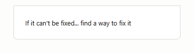

# WEEK 1, Les 1  + 2

# module 1 Getting started 

# 1) Introduction

- NEXED: 
    - doe de module `1) Introduction` in Nexed
# 2) Installing the framework

- lees:
    ```
    om laravel te kunnen draaien heb je het volgende nodig:
    - een php installatie (met een recente versie)
        - en de juiste extensions aan
    - een composer installatie
    - npm moet geinstalleerd zijn
    - je moet een .env file hebben die werkt
    ```
    
- NEXED: 
    - doe de module `2) Installing the framework` in Nexed
        > Hieronder staan tips! lees die eerst even (lees niet doe)

>LET OP lees en doe wat hieronder staat (dit helpt):
> Je krijgt deze link https://laravel.com/docs/13.x/installation
> - php heb je al, maar doe de installatie stap
> doe het hoofdstuk: `# Installing PHP and the Laravel Installer`

- CHECK of composer het doet
    > in CMD: composer
    - zo niet check https://getcomposer.org/download/
- probeer nu de laravel/installer te installeren 
    > zie documentatie hierboven van laravel)
- VSCODE: https://blog.stackademic.com/vscode-for-php-and-laravel-ee04a37c1047

# !! DOE NU (voordat je verder gaat in nexEd)
- de opdracht in 
    > `WEEK 1 - 01 - Laravel test.md`

## 3) Directory structure
- kijk goed rond in het project:
> - waar staan je .blade.php files? 
> - speel even met de welcome.blade.php zoals in de oefening
> 


- maak de opdrachten in nexEd:
## 4) Resources
## 5) VSCode is Laravel's BFF
## 6) General knowledge 
