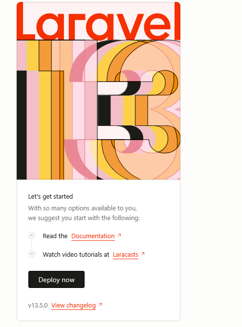

# START
- Maak een map M8Prog (bij je school werk zoals altijd)
- run dit commando:
    > `laravel new space_programming`
- je moet opties kiezen:
    - standaard TOT de AI, dat op NO
        > Dus: NONE, PEST, NO (even wachten), SQLite (wachten) yes run npm

# TESTEN
- ga naar de directory in de CMD
    > opdracht_new_app
    - run nu php artisan serve
        > geen npm run dev VITE wil nog wel eens problemen geven
    - open http://127.0.0.1:8000/
        - zie je laravel?
        > 

## klaar
- laat aan de leraar zien, dat je de laravel site werkend hebt

## Verder
- ga nu verder in:
    > `WEEK 1 - 00 - opdrachten planning.md`