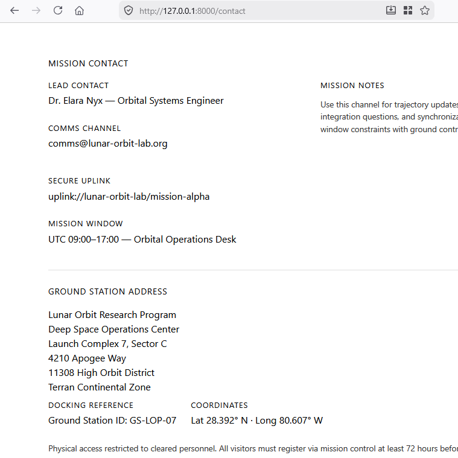

## start
- ga verder in je `space_programming` laravel project


## controller
- maak nu een extra controller
    - ContactController
        - zorg dat deze een contact view teruggeeft
            > - gebruik blade
            > - maak even een nep adres voor het bedrijf `'space programming'`
            >


## navigatie
- link in nav maken
    - lees
    > in laravel kan je links maken op basis van de name van een route:

```php

    Route::get('/afspraak/{id}', [AfspraakController::class, 'get'])->name('afspraak')
    
        <a href="{{ route('afspraak',['get'=> 1]) }}">afpsraak 1</a>

    //in web.php bij je route CHAIN je:
    Route::get('/mijnpagina', [PaginaController::class, 'get'])->name('mijnpagina')
    //->name is een CHAIN, wat uit Route::get komt is een object waar je weer functions op kan gebruiken zoals name(...)

    // in je blade kan je dan:
    <a href="{{ route('mijnpagina') }}"...
    
```


- link nu in je nav naar contact op deze manier
- en link terug naar home
    > gebruik named routes
    > !!let op:
    > - het stuk ` @if (Route::has('login'))` in je nav
    > - gebruik een @else om JOUW nav erbij te zetten


## klaar
- laat aan de leraar zien, dat je de laravel site werkend hebt

## Verder
- ga nu verder in:
    > `WEEK 2 - 00 - opdrachten planning.md`