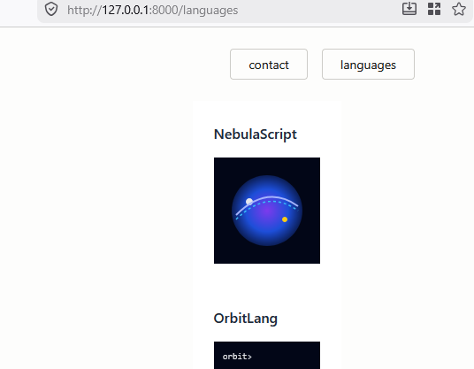
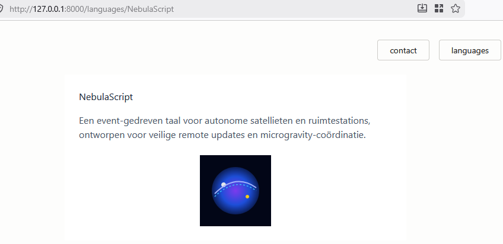
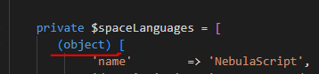
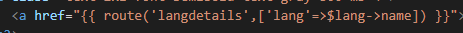

## start
- ga verder in je `space_programming` laravel project


## opdracht:

- lees:
```

we gaan nu een pagina maken die een lijstje laat zien en ook een link heeft naar de details
```

- bekijk het voorbeeld:
    >
    >

## Space programming languages

- maak een nieuwe Controller
    - `LanguageController.php`
        - geef die 2 functions:
            - list
            - details

## data
- verzin nu 3 space programmeer talen
    > gebruik ai om de talen te verzinnen (content dus) als je wil
    - zorg voor:
        - naam van de taal
        - beschrijving
        - icoon (svg) (sla deze op in public/assets/img)
    - vraag de data als een php class array
    - zorg dat alles objecten worden voorbeeld:
    > 

## views
- maak een nieuwe pagina:
    - languages.blade.php
    - language-details.blade.php
## route


- route naar beide functions
    - zorg dat je routes zo zijn:
        - `/languages` gaat naar list
        - `/languages/{lang}` gaat naar details en geeft daar $lang aan door
        

## views
- pas je views aan:
    - languages.blade.php
        - toont icoon
        - toont naam
        - linkt naar language-details
            > HINT: 
    - language-details.blade.php
        - toont icoon
        - toont naam
        - toont beschrijving


## controler->view

- zorg nu dat:
    - de function list van de controller `languages.blade.php` toont met alle talen
    - de function list van de controller `language-details.blade.php` toont de taal 
        > hint: array_filter & array_values om de taal te zoeken


## klaar?
- laat aan de leraar zien, dat je de laravel site werkend hebt