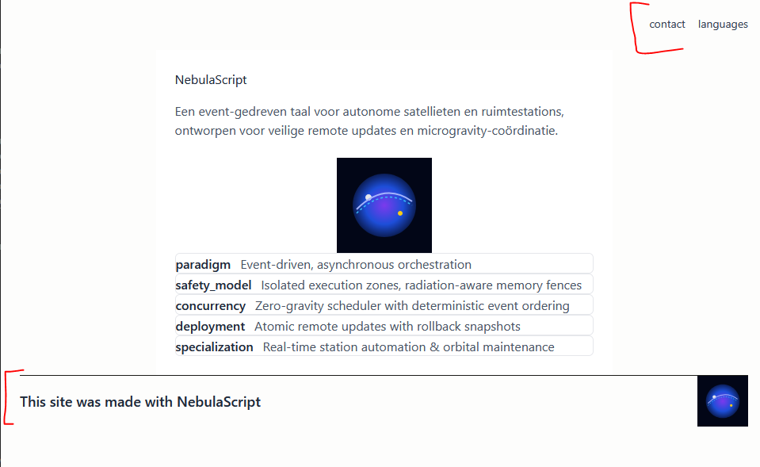
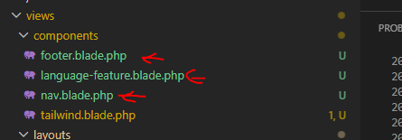
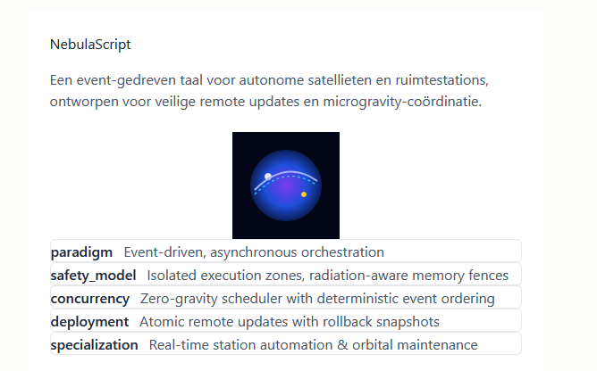

## start
- ga verder in je `space_programming` laravel project

## opdracht:

- gebruik nu componenten om:
    - je nav als component te maken
    - een footer erbij te doen
        - zet er iets in als this site was made with 'een space language'
    - voorbeeld:
        > 

- je files ongeveer:
    > 
## features

- gebruik AI om je data uit te breiden met language features
> Expand this data to include language features
- feature wordt een component
    - language-details tonen de features
        > 

## klaar?
- laat aan de leraar zien, dat je de laravel site werkend hebt