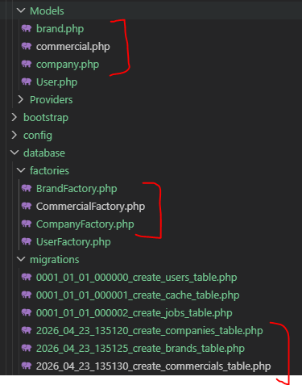
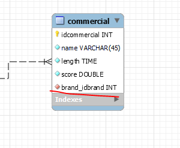
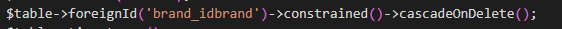
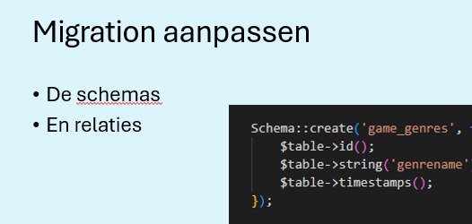
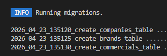
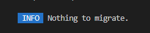
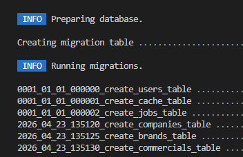

# nexed?

- we stappen even uit nexed

- maak een nieuw laravel project: `commercial_awards`
- maak hiervoor ook een git-repo

## setup

- bekijk het ERD
    - commercial_awards.mwb

- maak nu met `php artisan make:model TABLENAME -mf`
    - de tabellen uit de ERD
    - let op de volgorde! de tabellen DIE door andere nodig zijn moeten eerst:
        ```
        php artisan make:model company -mf
        php artisan make:model brand -mf
        php artisan make:model commercial -mf
        ```

        php artisan make:model company -mf
        php artisan make:model brand -mf
        php artisan make:model commercial -mf

## CHECK
- controlleer je files:
    > 


## Table create in je migrations

- lees:
    ```
    voor je relations en foreighkeys moet je even het truukje kennen. gebruik de plaatjes hieronder. Je naamgeving is super belangrijk, ik hou die van de ERD aan, jullie dus ook!
    ```
- bekijk RELATIONS hints:
    > 
    > wordt dan:
    > 

- vul nu je migrations aan op basis van de ERD
    > zie de presentatie 
    > 


## Php artisan migrate

- run nu je migrations:
    `php artisan migrate`
    - als het goed is zie je alleen je nieuwe migrations!!
        > dus 3 in totaal  
        > 
- run nog een keer `php artisan migrate`
    >   
    > omdat er niets nieuws is

- check of je je tabellen hebt (met een sqlite inspector, of mysql workbench als je mysql had gebruikt *advanced*)
- run nu `php artisan migrate:fresh`, dit maakt nu alles overnieuw
    > 

## klaar?

- controlleer met de docent