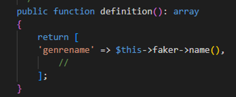

## data

- open CompanyFactory.php
    - gebruik het hint plaatje hieronder om data in je company te zetten
        > 
        - leuke woorden tip
            > - gebruik $faker->word(2, true) of ->company()  
            > - meer hints staan in de cheatsheet in de help directory

## Seeder

- open DatabaseSeeder.php
    - voeg toe (onder user):
    ```php
    
        Company::factory()->count(10)->create();//temp
    ```
    - zie je hoe dit werkt?
        > later gaan we vanuit de commercial werken

## SEED!

- run nu `php artisan db:seed`
    - check of je data hebt:
        > 

- en als je alles in 1 keer wil doen:
    > `php artisan migrate:fresh --seed`


## Brand

- ga naar de BrandFactory.php
    - vul zelf de name in
    - voor de company relation:
        > 
        - zie je hoe dit werkt?

- do nu CommercialFactory helemaal zelf

## Seeder
- open DatabaseSeeder.php
- gebruik nu Commercial in plaats van Company
- controlleer of al je tabellen nu gevuld zijn

## klaar?

- controlleer met de docent