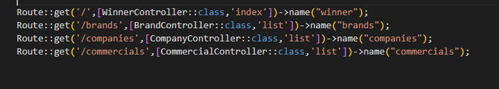
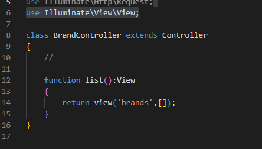
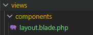
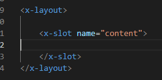

## Controllers

- maak controllers:
```
php artisan make:controller BrandController
php artisan make:controller CompanyController
php artisan make:controller CommercialController
php artisan make:controller WinnerController
```


- maak nu routes:
    > 

- maak nu de controllers compleet (voor nu) gebruik dit brand voorbeeld
    > 


## Views

- maak een layout aan in components:
    > 
    - vul met het ! shortcut voor html
    - pak de styling out welcome.blade.php
    
- maak nu de blade views aan:
    > hint layout setup
    > 
    - companies 
    - winner (gebruik hier welcome.blade.php voor)
    - commercials
    - brands 


## layout

- vraag aan AI een html voor de commercial awards
   ```I would like a html layout (use tailwind) for a commercial awards show website, i want a layout, a nav and a footerit will have these pages:
   - companies 
   - winner 
   - commercials
   - brands
   ```
   - vervang harde links door named routes
   - verdeel de html goed over de files!

