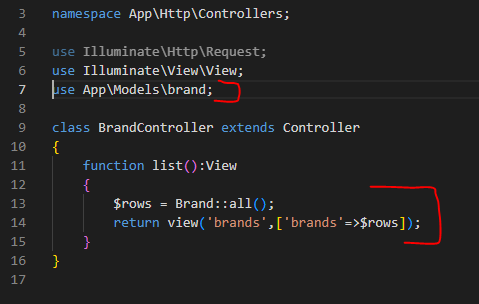
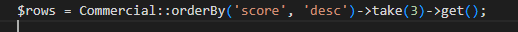

## data tonen

- we beginnen met brand, open je BrandController

  - lees:
    > je Model heeft methodes zoals ::all() om alles te selecteren die gaan we gebruiken
    
    - maak het volgende na:
      > 
     
    - toon nu de naam (brand colom) in de list van brands.blade.php

## andere controllers en views:
- doe hetzelfde voor de andere controllers:
  - companies (shows name)
  - commercials (shows score, name, length of commercial)

## winner

- open WinnerController
- voor winner moeten we iets anders doen:
  > 
  - begrijp je deze?
  - zorg dat de plaats er ook bij staat:
    > 

- is dat dezelfde html?
  - maak er een component van!