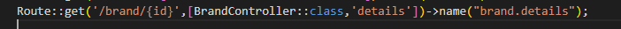
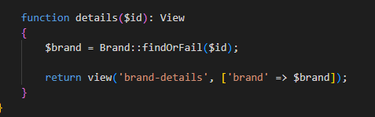
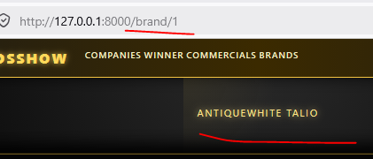
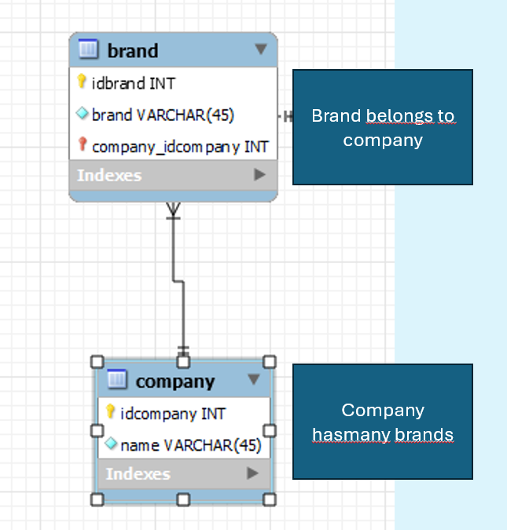
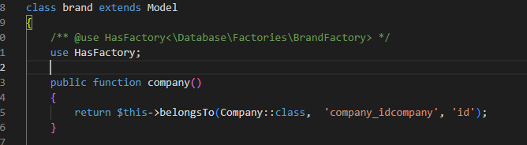
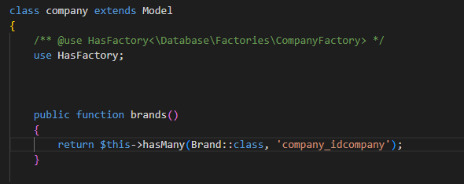
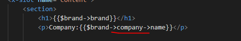
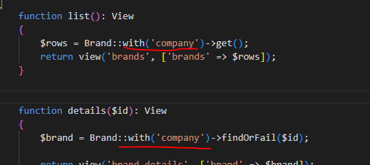
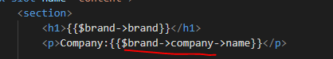
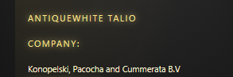

## detail paginas

- maak nu een detail pagina voor Brand
  - brand-details.blade.php
  - maak een route:
    > 


- in je BrandController:
    > 
    - lees:
    ```
    hier zeg je vind in de table de rij met id $id, zo niet gooi een 404 not found
    ```

- maak de detail pagina compleet zodat die laad:
    > 


## Het bedrijf tonen

- lees:

``` 
wij deden dat met een join, in laravel kan dat maar we doen het op de andere manier die meer laravel achtig is

- hiervoor moeten we voor elke relatie beide objecten een verwijzing geven

```
- bekijk deze nog even:
  > 


## BRAND aanpassen
- open Brand.php (het model)
  - Voeg de company function to met belongs to 
    > 
    > - we moeten even goed zeggen welke colom bij welke hoort, zie jij waar we dat doen? zo niet bekijk de ERD

- open nu Company (de andere kant van de relatie)
  - Voeg de brands function toe met hasMany
    > 
    > - we moeten even goed zeggen welke colom bij ONS hoort, zie jij waar we dat doen? zo niet bekijk de ERD
  
## Controller

- ga naar de BrandController
  - we kunnen dit al doen in onze blade:
    > 
    - maar die select elke keer per rij, dat is NIET ok
      - zet WITH erbij
        > 
    - in je blade toon je nu de company:
        > 
  - je krijgt:
    > 

## wire

- zorg nu voor de commercial-brand relatie:
  - commercial belongsTo brand
  - brand hasmany commercials 
    > net als hierboven! let op je colom namen

## compleet maken

- zorg ervoor dat je detail paginas de relatie objecten laten zien, en dat je kan doorclick naar die detail paginas
  